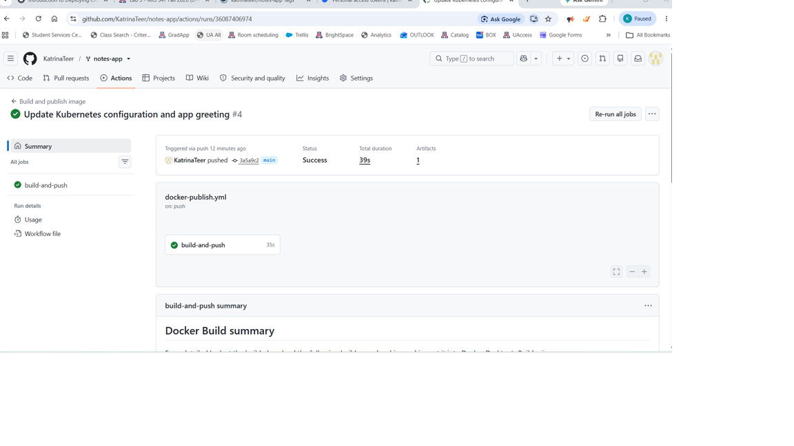
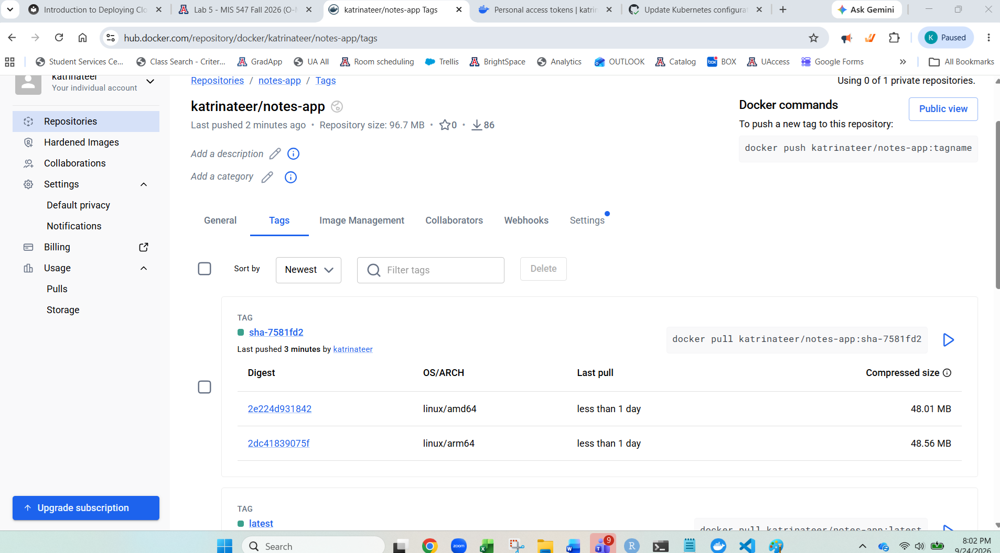

# Lab 5 Evidence

## 1. Successful GitHub Actions Run


## 2. Docker Hub Multi-Architecture Image


## 3. Kubernetes Resources
```text
NAME                       READY   STATUS    RESTARTS   AGE
pod/db-6c5c8947cd-dvv5p    1/1     Running   0          16m
pod/web-7476bcfd9d-dmwvj   1/1     Running   0          2m58s
pod/web-7476bcfd9d-spxcj   1/1     Running   0          2m51s

NAME          TYPE        CLUSTER-IP      EXTERNAL-IP   PORT(S)    AGE
service/db    ClusterIP   10.96.178.137   <none>        5432/TCP   124m
service/web   ClusterIP   10.96.191.242   <none>        80/TCP     121m

NAME                  READY   UP-TO-DATE   AVAILABLE   AGE
deployment.apps/db    1/1     1            1           124m
deployment.apps/web   2/2     2            2           121m

NAME                             DESIRED   CURRENT   READY   AGE
replicaset.apps/db-6c5c8947cd    1         1         1       33m
replicaset.apps/db-758c94b578    0         0         0       124m
replicaset.apps/web-6f794d8cb8   0         0         0       121m
replicaset.apps/web-7476bcfd9d   2         2         2       25m
replicaset.apps/web-895bc8bdb    0         0         0       6m15s

NAME                            STATUS   VOLUME                                     CAPACITY   ACCESS MODES   STORAGECLASS   VOLUMEATTRIBUTESCLASS   AGE
persistentvolumeclaim/db-data   Bound    pvc-ca1bc736-c4bd-495d-ac0a-408732f70cf9   1Gi        RWO            standard       <unset>                 33m
```

## 4. Persistence and Load-Balancing Experiments
### Experiment 2 - Persistent Data

After deleting and recreating the database pod:

```text
[{"body":"hello from kubernetes","created_at":"2026-09-25T02:28:21.664026+00:00","id":1},{"body":"I should survive a pod deletion","created_at":"2026-09-25T02:33:40.421079+00:00","id":2}]
```

### Experiment 3 - Load Balancing

Requests to the web Service were handled by multiple web replicas:

```text
{"message":"Hello from the notes app!","served_by":"web-7476bcfd9d-wql7f","service":"notes-app"}
{"message":"Hello from the notes app!","served_by":"web-7476bcfd9d-ghcw7","service":"notes-app"}
{"message":"Hello from the notes app!","served_by":"web-7476bcfd9d-jrqd2","service":"notes-app"}
{"message":"Hello from the notes app!","served_by":"web-7476bcfd9d-jrqd2","service":"notes-app"}
{"message":"Hello from the notes app!","served_by":"web-7476bcfd9d-786nk","service":"notes-app"}
```

## 5. Rolling Update History
The application was successfully updated to the new SHA-tagged image and then rolled back.

```text
deployment.apps/web
REVISION  CHANGE-CAUSE
1         <none>
3         <none>
4         <none>
```